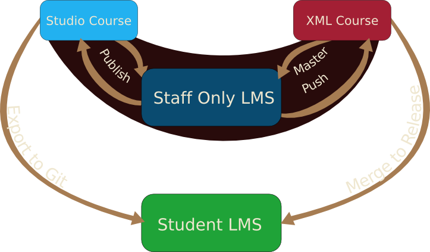

class: title, center, middle

# Git-based Courses

### Carson Gee and Peter Pinch

---

# Peter Pinch

- education at scale
- pbs.org, pbslearningmedia.org 
- MIT OpenCourseWare
- MITx multitool 
- Ask me about talking aardvarks

---

# Carson Gee

- Seriously into process automation
- Over a year with Open edX
- Over 100 PRs between platform and configuration
- Not serious about much else

.head-float[

]

---

# Git Course Flow Overview

???
Mention how github/gitlab hooks tie this together
---
class: big_bullets

# What We'll Cover

- Course Production Workflow
- How to make it go (tech details)

---
