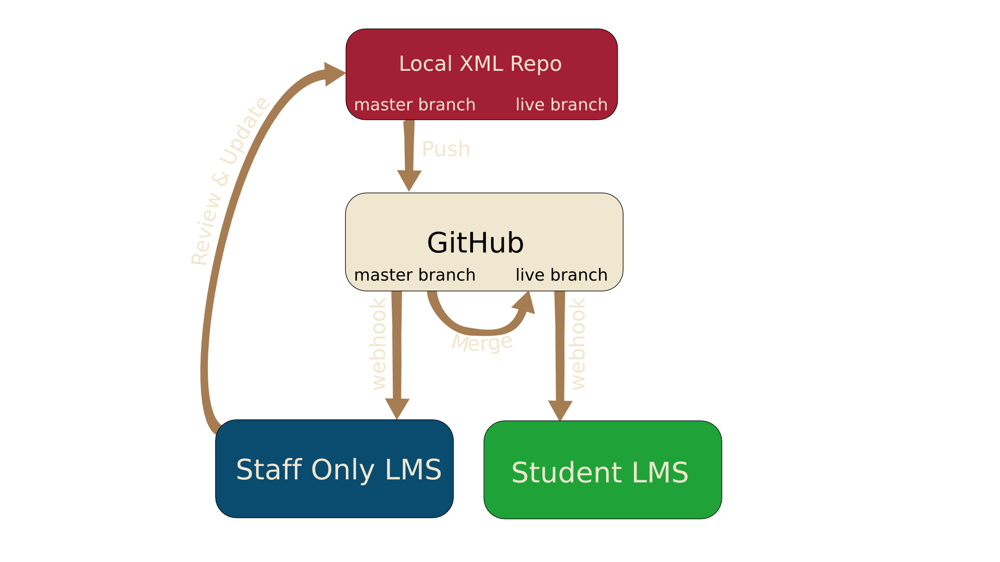
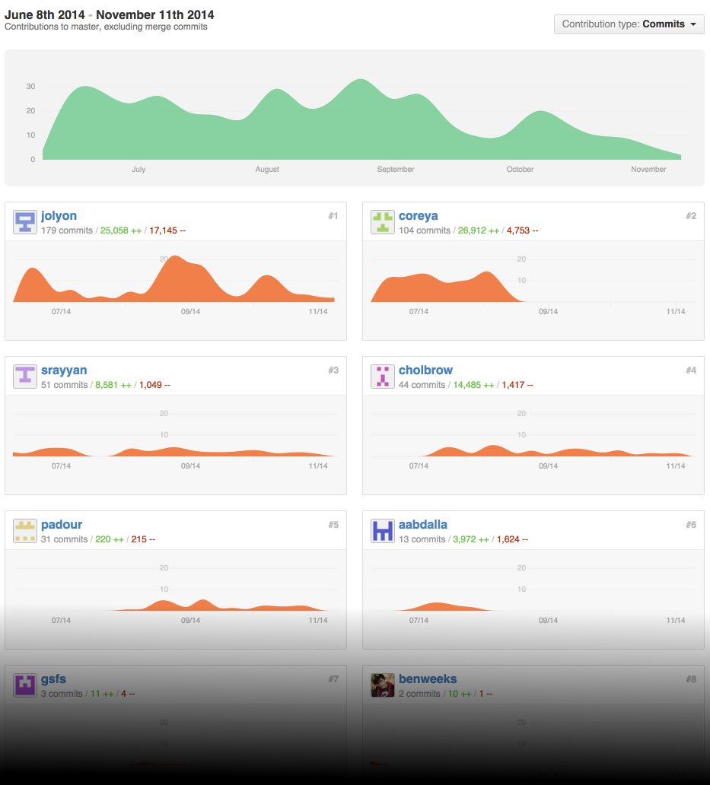
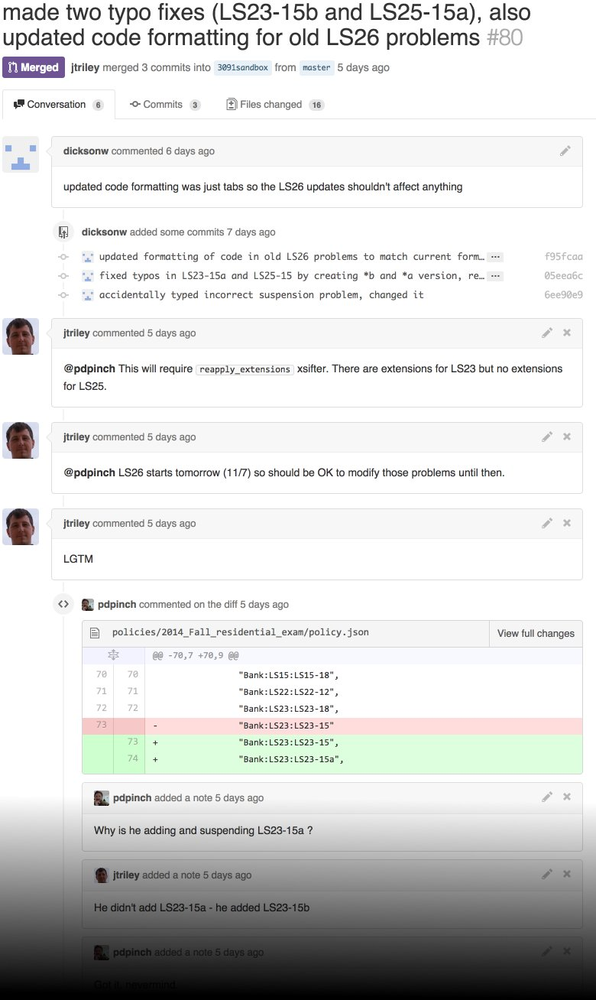
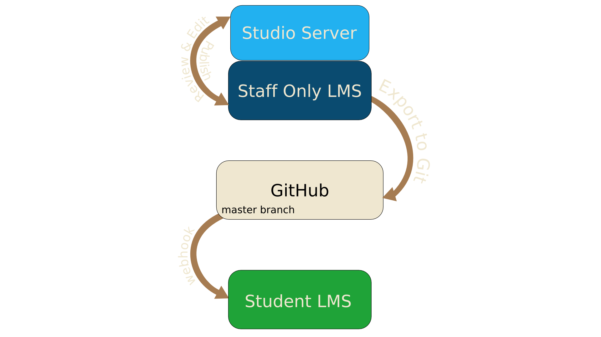

# Course Production Workflow

## Course teams want to:
- use familiar tools 
- migrate content
- manage versions
- manage multiple contributors
- preview and release

---

# Course Production Workflow

## Admins need to:
- help course teams, safely 
- bulk updates
- move courses from staging to production
- archive (and restore) courses

---

# XML Course Development

1. edit XML
2. commit and push to master branch
3. trigger ➞ updates course on staging server
4. review on staging, repeat as necessary
5. merge to live branch
6. trigger ➞ updates course on production server 

---

class: graph 

# XML Course Development

---

class: screenshot center 

## example commit graph

---

class: screenshot center

## example PR with comments

---

# Studio Course Development

1. author course on studio server
2. review on staging server, repeat 
3. export to Git
4. trigger ➞ updates course on production server

---

class: graph 

# Studio Course Development

---
