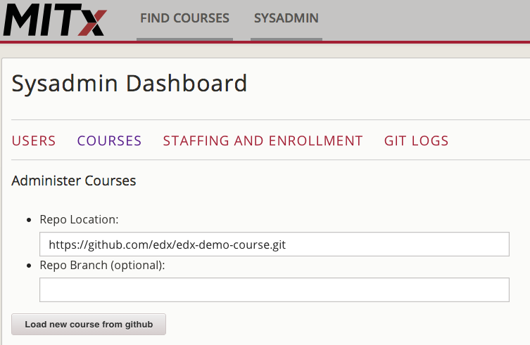

class: big_bullets
# Technical Implementation

- Course Import and Export via Git
- Workflow Automation

???
Quick overview slide, just skip through

---

.left-column[
# Course Import/Export
## - Course Import
### - Course Export
# Automations
### - gitreload
### - ContentStore
]

.right-column[
# Git Course Import via Command
```bash
sudo su - edxapp -s /bin/bash
. edxapp_env
mkdir /edx/var/edxapp/course_repos
python edx-platform/manage.py lms --settings=aws \
  git_add_course http://github.com/edx/edx-demo-course 
```
## Options
- Directory to check out into
- Branch to use
]

???
Talk about what this actually i.e.
- Defaults to /edx/var/edxapp/course_repos
- Git clones/pulls
- Check out of branch is specced
- Increases logging to debug
- Runs Studio import command
- Stores import log to git logs in Dashboard
---

.left-column[
# Course Import/Export
## - Course Import
### - Course Export
# Automations
### - gitreload
### - ContentStore
]

.right-column[
# Sysadmin Dashboard Import
Enable with:
```python
ENABLE_SYSADMIN_DASHBOARD=True
```
flag in `FEATURES` dict
- Head to: `https://<your_instance>/sysadmin` with global staff privs
]

---

.left-column[
# Course Import/Export
## - Course Import
### - Course Export
# Automations
### - gitreload
### - ContentStore
]

.right-column[
# Sysadmin Dashboard Import


]

---

.left-column[
# Course Import/Export
## - Course Import
### - Course Export
# Automations
### - gitreload
### - ContentStore
]

.right-column[
# Sysadmin Dashboard Import


]
???
Next slide is export, so intro it
---

.left-column[
# Course Import/Export
### - Course Import
## - Course Export
# Automations
### - gitreload
### - ContentStore
]

.right-column[
# Git Course Export via Command
```bash
sudo su - edxapp -s /bin/bash
. edxapp_env
mkdir /edx/var/edxapp/export_course_repos
cd edx-platform
python manage.py cms --settings=aws \
  git_export edX/DemoX/Demo_Course \
  git@github.com:carsongee/edx-demo-course.git
```

## Options
- username (for commit authorship)
- repo_dir (specify location of local repo location)
]
???
Mention our backup
---

.left-column[
# Course Import/Export
### - Course Import
## - Course Export
# Automations
### - gitreload
### - ContentStore
]
.right-column[
# Export to Git in Studio
Enable with:
```python
ENABLE_EXPORT_GIT=True
```
flag in `FEATURES` dict
- Set `giturl` in course's advanced settings

]

---

.left-column[
# Course Import/Export
### - Course Import
## - Course Export
# Automations
### - gitreload
### - ContentStore
]
.right-column[
# Export to Git in Studio


]
???
Moving to workflow automation - intro

---

.left-column[
# Course Import/Export
### - Course Import
### - Course Export
# Automations
## - gitreload
### - ContentStore
]
.right-column[
# Workflow Automation
Enter gitreload:
https://github.com/mitodl/gitreload

- Responds to hooks from github/gitlab
- Runs `git_add_course` from hookshot
- Only operates on courses already checked out
]

???

Maybe mention branch settings and security

---

.left-column[
# Course Import/Export
### - Course Import
### - Course Export
# Automations
## - gitreload
### - ContentStore
]
.right-column[
# Installing gitreload

Try before you buy:

```bash
sudo su - edxapp -s /bin/bash
. edxapp_env
pip install gitreload
gitreload
```
Install for realsies with Ansible:
```yaml
 - hosts: all
   sudo: True
   vars:
     COMMON_ENABLE_BASIC_AUTH: True
   roles:
     - gitreload
     - role: nginx
       nginx_sites:
         - gitreload
```
]

???

Port 5000 in trial
Port 8095/18095 in real
vagrant will require port forward
---

.left-column[
# Course Import/Export
### - Course Import
### - Course Export
# Automations
### - gitreload
## - ContentStore
]
.right-column[
# Who needs ContentStore?

- Setup shared filesystem for course storage
- Symlink to:
```
{{ edxapp_data_dir }}/course_static
```
- Set `GIT_IMPORT_STATIC=False`
]
???
- gridfs is slow and eats application workers
- ContentStore slows down import dramatically
- Only need shared if clustered
---
class: small_code

.left-column[
# Course Import/Export
### - Course Import
### - Course Export
# Automations
### - gitreload
## - ContentStore
]
.right-column[
# Who needs ContentStore?

Add to static nginx server rule:
```perl
  location ~ ^/static/(?P<file>.*) {
      root {{ edxapp_data_dir }};
      try_files /staticfiles/$file
	    /course_static/$file =404;
```
Changes to:
```perl
location ~ /static/((?P<dir>[^/]+)/(?P<file>.*)|(?P<rfile>[\w\d\-.]+)) {
        root {{ edxapp_app_dir }};
        try_files /staticfiles/$dir/$file
		  /course_static/$dir/static/$file
		  /staticfiles/$rfile =404;
```
]

---
